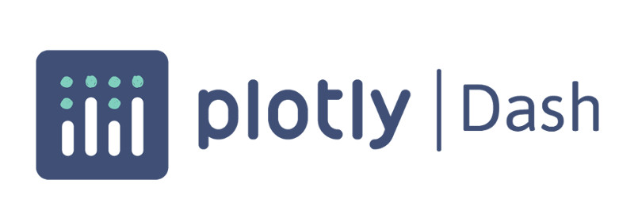

# Dash - From Zero to Hero

> (desculpe pelo título tão manjado) Neste repositório eu reuno alguns materiais interessantes sobre a Dash que podem servir de exemplo para quem quer aprender a utilizar a ferramenta ou consulta para quem já conhece! Partindo do básico, para quem nunca viu HTML ou CSS até abordar os principais conceitos de Dash. Um minicurso ;)

## O que é Dash?

O Dash é uma ferramenta para criação de aplicativos analíticos baseados na web, tem o seu código-fonte aberto e pode ser utilizado na linguagem Python. Por enquanto, isso é tudo que você precisa saber, você vai entender melhor se ver o que o Dash pode fazer.

Você pode ler artigos sobre Dash e mais detalhes sobre os notebooks no Medium:

* Dá uma olhadinha lá: [https://medium.com/@andcordeiro](https://medium.com/@andcordeiro)

## Como praticar?

Você pode reproduzir os exemplos na sua máquina ou utilizando alguma ferramenta online, como o [Google Colab](https://colab.research.google.com/) 

## Curtiu? Entre em contato

Anderson Cordeiro
* [Github](https://github.com/andersoncordeiro)
* [LinkedIn](https://www.linkedin.com/in/anderson-cordeiro-26986430/)
* [Medium](https://medium.com/@andcordeiro)

É isso! =)

## License
This project could be used by anyone! MIT License